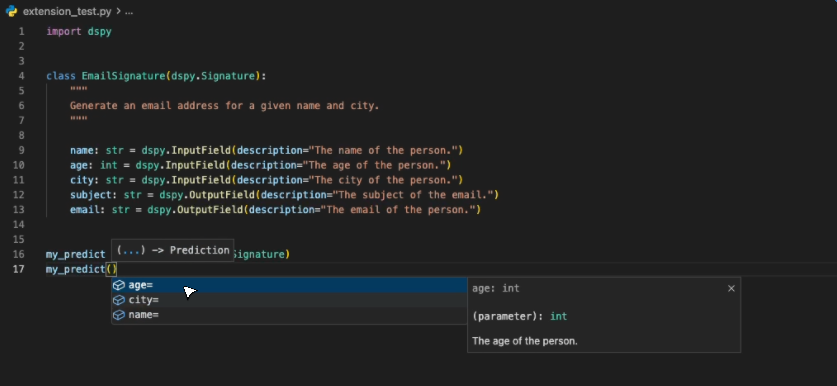
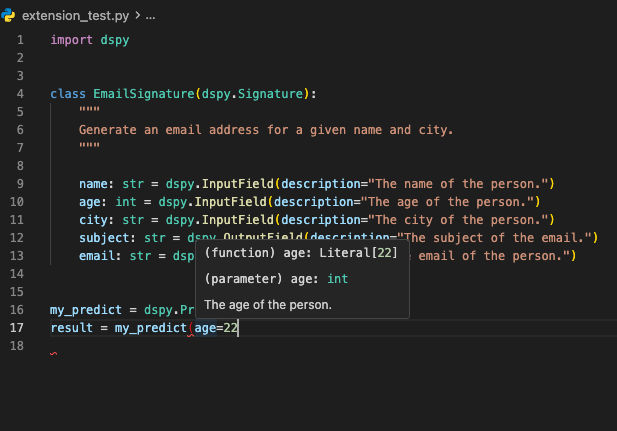
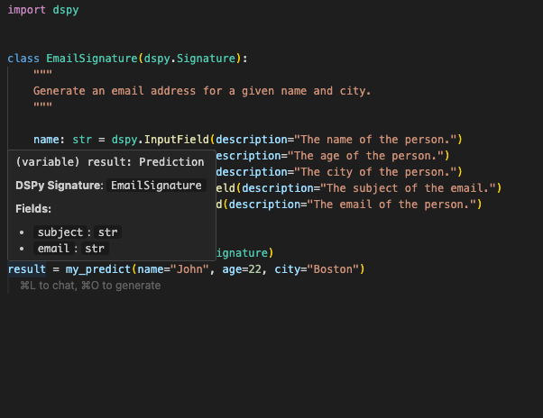
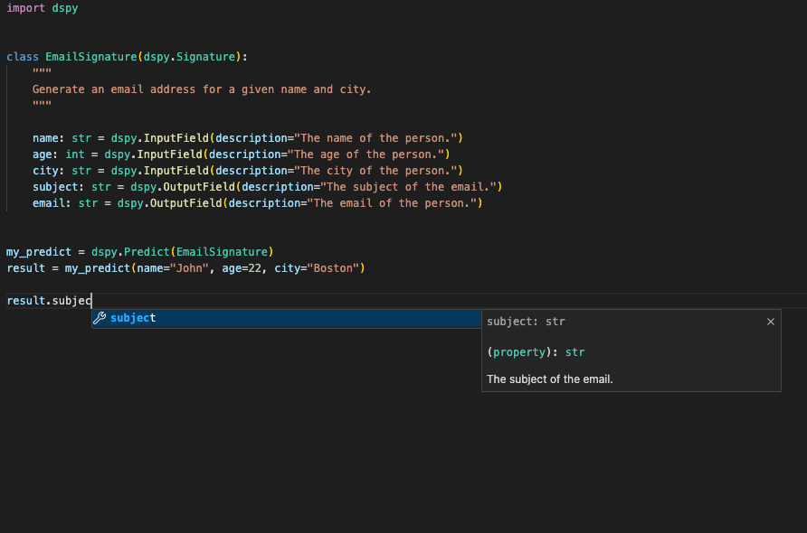
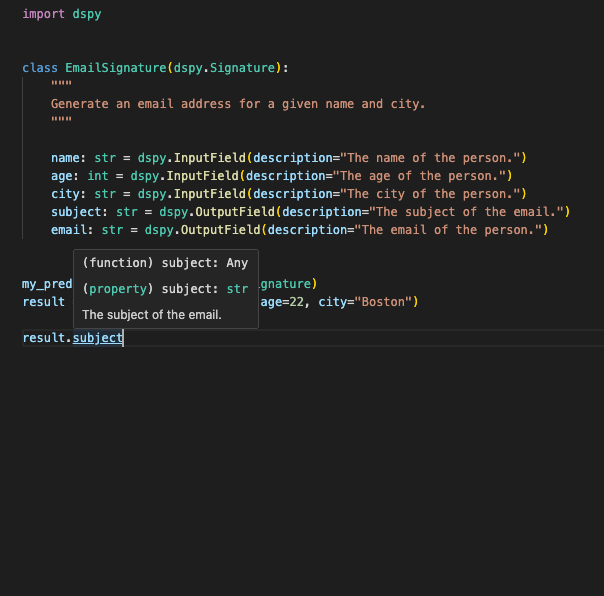
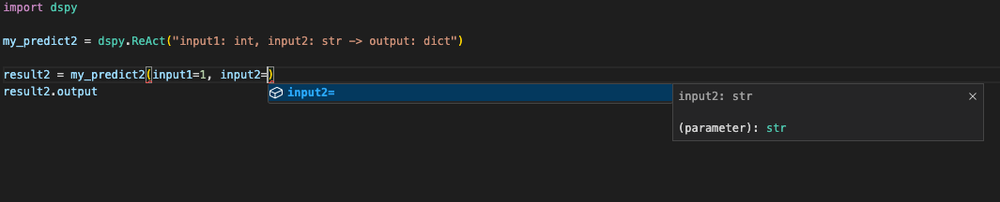

# dspy-intellisense by Modaic

IntelliSense for DSPy. Tracks and annotates input and output fields from Signatures to Predictions.

## Features

### Completion suggestions for inputs



### Hover annotations for inputs



### Hover annotations for `Prediction` objects



### Completion suggestions for outputs



### Hover annotations for outputs



### Works with inline signatures too!



## Extension Settings

You can change the highlight color of Prediction output fields by changing the following VSCode `settings.json`. Note, by default the highlight color is `#9CDCFE`

```json
{
  "dspyIntellisense.decorationHighlighting.color": "#a5e075" // change to your preferred output field highlight color
}
```

## Known Issues

- The highlight color of output fields will not match your theme's color for attributes by default. You must configure it mannually using the `"dspyIntellisense.decorationHighlighting.color"` setting.

## Release Notes

### 1.0.0

Initial release of DSPy IntelliSense
